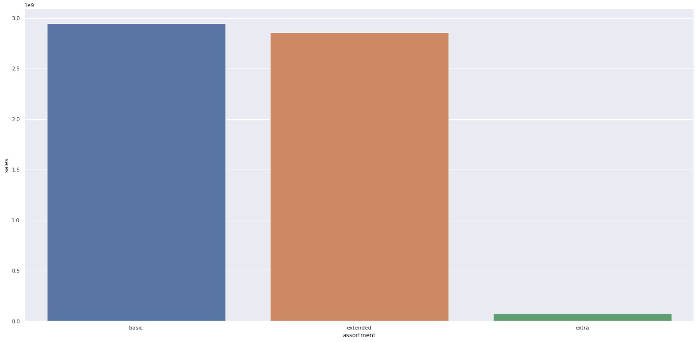
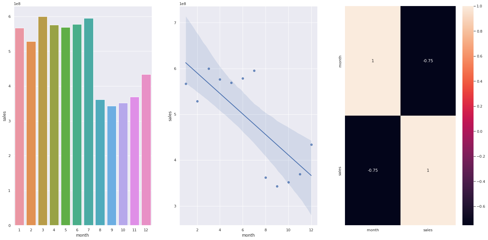
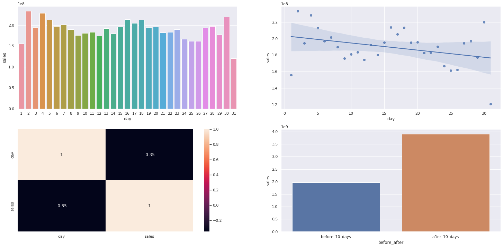
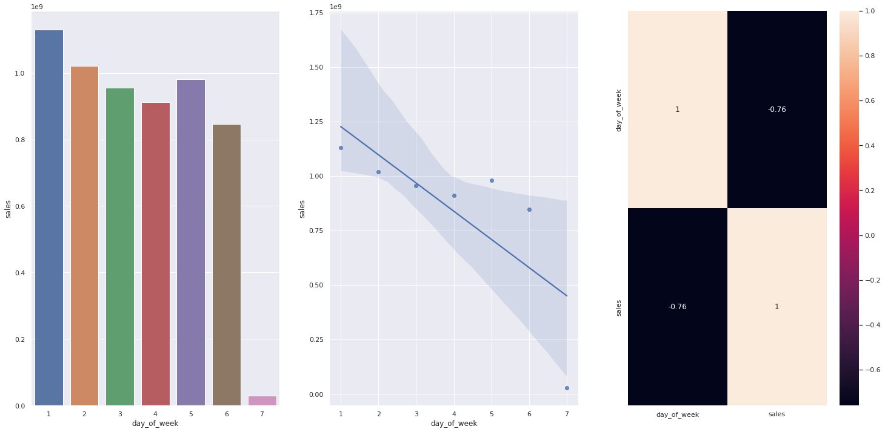
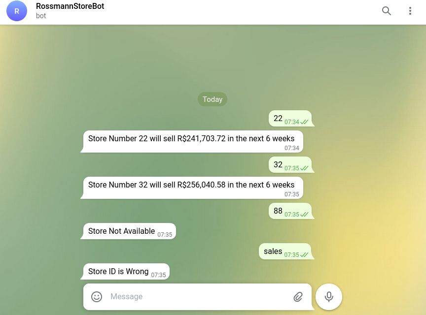

# Previsão de vendas

*Disclaimer:** O Contexto a seguir, é completamente fictício, a empresa, o contexto, as perguntas de negócio foram criadas apenas para o desenvolvimento do projeto, e se baseiam em um desafio do Kaggle. 
<!---

  

-->

## Contexto de negócio

Uma das maiores redes de drogarias da Europa a Rossmann opera mais de 3000 unidades em 7 paises da europa. Com o sucesso de sua marca, a Rossmann planeja uma reforma geral em todas as suas lojas, porem atualmente a previsão de vendas é feitas através de uma planilha em excel considerando a média das vendas, achando essa metodologia falha e antiga, a administração da empresa busca novas soluções.

Foi realizada uma reunião com os gerentes, diretores e CEO da Rossmann, para planejarem as reformas nas lojas Rossmann a fim de renovar a estética e padronizar as lojas, para essa reforma ser possível a equipe de negócios da Rossmann precisaria contar com as previsões de vendas de todas as lojas para as proximas 6 semanas, porem como atualmente as previsões de vendas eram feitas somente por planilha de média, é impossível ter noção da grandeza de vendas individuais e oscilações de vendas entre cada loja. Diante disso a empresa decidiu contratar um cientista de dados, para ficar ciente de qual é a melhor solução para o problema.

Durante a reunião o cientista de dados explicou os detalhes de uma previsão de vendas, bem como os metódos que poderiam ser utilizados. Ao final da reunião ficou a cargo do cientista de dados montar um modelo de previsão de vendas com base em machine learning para responder a questão de negócio da empresa.

### Questão de negócio

Qual o valor de venda de cada loja nas próximas seis semanas?

## Premissas Assumidas

Para fazer previsões para as próximas seis semanas, a empresa Rossmann precisa fornecer dados sobre suas lojas para esse intervalo de tempo. Esses dados, para cada loja, devem incluir: modelo da loja, nível de sortimento da loja e se a loja em questão estará em promoção contínua.

## Dados

O conjunto de dados que representam o contexto está disponível na plataforma do Kaggle. Esse é o link: https://www.kaggle.com/c/rossmann-store-sales/data. O dataset possui os seguintes atributos:

 
| Atributos                        | Explicação                                                      |
| -------------------------------- | ------------------------------------------------------------ |
| Id                               | Um Id que representa uma dupla (Store, Date) dentro do conjunto de teste |
| Store                            | Um id único para cada loja                                   |
| Sales                            | O volume de vendas para qualquer dia                         |
| Customers                        | O número de clientes em um determinado dia                       |
| Open                             | Um indicador para saber se a loja estava aberta: 0 = fechada, 1 = aberta |
| StateHoliday                     | Indica um feriado estadual. Normalmente todas as lojas, com poucas exceções, fecham nos feriados estaduais. Observe que todas as escolas fecham nos feriados e finais de semana. a = feriado, b = feriado da Páscoa, c = Natal, 0 = Nenhum |
| SchoolHoliday                    | Indica se (Loja, Data) foi afetado pelo fechamento de escolas públicas |
| StoreType                        | Diferencia entre 4 modelos de loja diferentes: a, b, c, d  |
| Assortment                       | Descreve um nível de estoque: a = básico, b = extra, c = estendido |
| CompetitionDistance              | Distancia em metros do competidor mais proximo           |
| CompetitionOpenSince[Month/Year] | Dá o ano e mês aproximados em que o concorrente mais próximo foi aberto |
| Promo                            | Indica se uma loja está fazendo uma promoção naquele dia         |
| Promo2                           | Promo2 é uma promoção contínua e consecutiva para algumas lojas: 0 = a loja não está participando, 1 = a loja está participando |
| Promo2Since[Year/Week]           | Descreve o ano e a semana em que a loja começou a participar da Promo2 |
| PromoInterval                    | Descreve os intervalos consecutivos de início da promoção 2, nomeando os meses em que a promoção é iniciada novamente. Por exemplo. "Fev, maio, agosto, novembro" significa que cada rodada começa em fevereiro, maio, agosto, novembro de qualquer ano para aquela loja |

## Planejamento da solução

**1. Entendimento do negócio** - Entender os reais motivos da necessidade da previsão de vendas e como o probelma pode ser resolvido através de machine learning, quais aspectos serão considerados na hora da predição e quão melhor a solução proposta pode ser considerando os modelos de predição utilizados atualmente na empresa.    

**2. Coleta de dados** - Acesso a plataforma do Kaggle para download dos arquivos.

**3. Limpeza dos dados** - Os dados são analisados usando diferentes técnicas para verificar a existência de dados faltantes, outliers, ou qualquer tipo de inconsistências para que assim possam ser tratados devidamente e não impactar nas análises futuras. 

**4. Exploração dos dados** - O entendimento do negócio através da geração de insights e das variáveis mais importantes na modelagem do modelo de Machine Learning. Diversas hipóteses foram levantadas e validadas para obtenção de um conhecimento de negócio mais profundo, verificando também a correlação entre os atributos para que se possa ter uma ideia da importância de cada um para o modelo de machine learning. 

**5. Preparação dos dados** - Transformação, balanceamento e encoding dos dados para que os algoritmos de machine learning possam ter o melhor desempenho possível, e as possíveis inconsistencias no dataset não interfiram no resultado final.

**6. Seleção de features** - Após a preparação dos dados são selecionadas as melhores colunas a serem utilizadas para o treinamento do modelo de machine learning. Tais colunas serão analisadas e selecionadas de acordo com descobertas feitas na análise exploratória e levando em conta o contexto de nagócio.

**7. Aplicação dos algoritmos de Machine Learning** - Após a escolha dos algoritmos de machine learning a serem usados, os mesmos foram treinados com os dados já preparados e prontos. Cada algoritmo foi testado usando seus devidos parâmetros e posteriormente aplicados a técnica de cross validation para verificar o real resultado do medelo.

**8. Hyperparameter Fine Tunning** - : Escolha dos melhores valores para cada um dos parâmetros do modelo escolhido na etapa anterior.

**9. Avaliação da performace e conversão do desempenho em valores de negócio** - Com o melhor modelo escolhido, treinado e otimizado, a taxa de erro encontrada é trasnformada em métricas. Essas métricas são avaliadas e transformadas em métricas de negócio para que se saiba concretamente quanto de retorno financeiro a solução trouxe para a empresa. Após a apresentação para o time de negócio, verifica-se ou não a necessidade de realizar mais um ciclo para melhorar o desempenho final.

**10. Deploy do modelo em produção** - O modelo é publicado em produção em um ambiente cloud (Ex:Heroku) para que as predições possam ser utilizadas através de requisições a uma API parar melhorar a tomada de decisão do negócio.

**11. Telegram Bot:** Criação de um bot no aplicativo de mensagens telegram, para consultar a previsão a qualquer momento .

## Melhores Insights
**H1. Lojas com maior sortimentos deveriam vender mais.**
> H1 é FALSA. Lojas com maior sortimento vendem menos.

**H9. Lojas deveriam vender mais no segundo semestre do ano.**
> H9 é FALSA. Lojas vendem menos no segundo semestre do ano.

**H10. Lojas deveriam vender mais depois do dia 10 de cada mês.**
>H10 É VERDADEIRA. Lojas vendem mais depois do dia 10 de cada mês

**H11. Lojas deveriam vender menos aos finais de semana.**
>H11 É VERDADEIRA Lojas vendem menos aos finais de semana

## Modelos de Machine Learning aplicados

Os algoritmos utilizados para fazer a predição foram:

- Average Model; 
- Linear Regression;
- Linear Regression Regularized (Lasso);
- Random Forest Regressor;
- XGBoost Regressor.

##  Comparação da Performance dos modelos de Machine Learning

**Single Performance**

| Model Name | MAE    | MAPE      | RMSE |
|-----------|---------|-----------|---------|
|  Random Forest Regressor  | 689.646840 | 0.101283   | 1026.647344 |
|  XGBoost Regressor	  | 868.958204 | 0.130309   | 1238.550842 |
|  Average Model  | 1354.800353 | 0.455051   | 1835.135542 |
|  Linear Regression	  | 1867.089774 | 0.292694   | 2671.049215 |
|  Linear Regression - Lasso	  | 1891.704881 | 0.289106	   | 2744.451737 |

**Real Performance - Cross Validation**

| Model Name | MAE CV   | MAPE CV      | RMSE CV |
|-----------|---------|-----------|---------|
|  Random Forest Regressor  | 850.27 +/- 223.53| 0.12 +/- 0.02  | 1274.22 +/- 326.71 |
|  XGBoost Regressor  | 1064.95 +/- 178.65 | 0.15 +/- 0.02   | 1519.92 +/- 242.12 |
|  Linear Regression  | 2081.73 +/- 295.63 | 0.3 +/- 0.02   | 2952.52 +/- 468.37 |
|  Linear Regression - Lasso  | 2116.38 +/- 341.5 | 0.29 +/- 0.01   | 3057.75 +/- 504.26 |

Após os testes e avaliações de performance dos modelos optou-se por utilizar o modelo **XGBoost Regressor**, que obteve uma performance muito satisfatória e é um modelo mais leve e rápido em comparação ao Random Forest, e que é um fator que pode fazer diferença quando colocado em produção.

**Final Performance - Hyperparameter Fine Tunning Cross Validation**

Após encontrar os melhores parâmetros para o modelo através do metódo Random Search as métricas finais para o modelo foram as seguintes:

| Model Name | MAE   | MAPE      | RMSE |
|-----------|---------|-----------|---------|
|  XGBoost Regressor	  | 608.013136 | 0.088114   | 895.765304 |

- MAE (Mean Absolute error) - Mostra o erro médio absoluto do modelo, tanto para mais quanto para menos.
- MAPE (Mean Absolute percentage error) - Erro médio absoluto em percentual.
- RMSE (Root mean squared error) - Erro médio absoluto quadrado, erro médio absoluto elevado ao quadrado. Não é a melhor métrica para uma análise de negócios, porém é muito util para avaliar a performance do modelo em si.

## Resultados
Através da interpretação do erro do modelo de machine learning foi possível traduzir o desempenho do modelo em desempenho de negócios com os resultados financeiros apresentados a seguir:

|store 	|predictions 	|worst_scenario 	|best_scenario 	|MAE 	|MAPE|
|-------|---------------|-------------------|---------------|-------|----|
|291 	|292 	|106257.78125 	|102944.948833 	|109570.613667 	|3312.832417 	|0.563564|
|908 	|909 	|235611.93750 	|228047.566597 	|243176.308403 	|7564.370903 	|0.509972|
|875 	|876 	|199501.93750 	|195537.438275 	|203466.436725 	|3964.499225 	|0.291110|
|594 	|595 	|406300.09375 	|402978.123073 	|409622.064427 	|3321.970677 	|0.228499|
|721 	|722 	|339043.21875 	|337428.428790 	|340658.008710 	|1614.789960 	|0.223701|

A tabela acima mostra através de algumas lojas selecionadas aleatoriamente suas respectivas previsões de venda, e, considerando o MAE obtido na previsão de cada loja durante o período de teste, foram projetados o melhor e o pior cenário de vendas de cada loja.

Na tabela abaixo, podemos observar o valor total de faturamento previsto entre todas as lojas, considerado o pior e melhor cenário.
|Scenario 	|Values|
|-----------|------|
|predictions 	|R$284,295,872.00|
|worst_scenario 	|R$283,603,418.12|
|best_scenario 	|R$284,988,326.74|

## Modelo em produção

O modelo colocado em produção contem uma  classe em python com todos o pipeline de processamento através de uma API que está hospedada no Heroku (https://www.heroku.com/), um bot no Telegram que pode ser acessado neste link 

Para visulizar as predições do modelo é preciso informar o numero da loja no chat do bot, passando apenas números. Caso o  número da loja não estiver disponível ele retorna uma mensagem informando. A imagem abaixo mostra um exemplo do funcionamento.

## Conclusão
Após completado o primeiro ciclo de todas as etapa do planejamento, chegou-se em um resultado satisfatório para o problema de negócio em questão. O Modelo XGBoost para o primeiro ciclo (Metodologia CRISP-DM) aprentou uma boa performance com um erro relativamente baixo, fazendo com que o time de negócios possa tomar decisões muito mais assertivas e ter uma boa previsibilidade da receita futura usando essa solução.

## Próximos passos

Para um segundo ciclo é possível fazer algumas abordagens diferentes, principalmente para tratar as lojas que apresentaram um comportamento difícil de serem previstos.

Possíveis abordagens para no segundo ciclo:

-Utilizar modelos de séries temporais para comparar o desempenho 

-Rescaling e Encode dos dados com outras metodologias

-Novas Features para previsão

-Utilizar métodos mais robustos para achar os melhores Hyper parametros para o modelo
